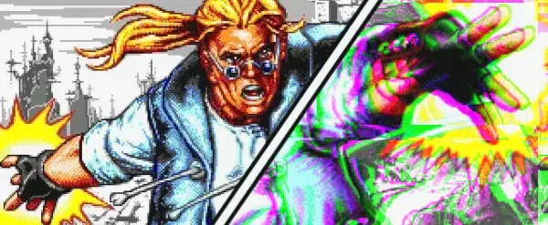

# Comics Zone: Glitch

 

Description

## Roadmap

- [x] Game engine
- [ ] Playable version
- [ ] Level 1
- [ ] Level 2
- [ ] Level 3
- [ ] Level 4

## Screenshots

...

## Technical features

- Custom game engine
- Can be rendered using 2D Canvas, WebGL or HTML/CSS
- Loads assets only needed for current scene
- Gamepad support

## License

Please see the [LICENSE](./LICENSE.md)
