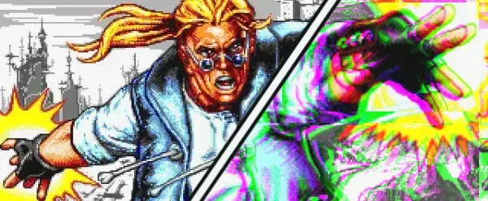

# Comics Zone: Multiverse

Description

## Roadmap

- [ ] Game engine
- [ ] Playable version
- [ ] Level 1

## Screenshots

...

## Gameplay

...

## Technical features

- Custom game engine
- Can be rendered using WebGL, WebGPU, 2D Canvas or HTML/CSS
- Keyboard/Gamepad support with key bindings
- ...

## License

Please see the [LICENSE](./LICENSE.md)
