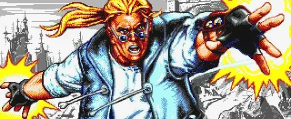
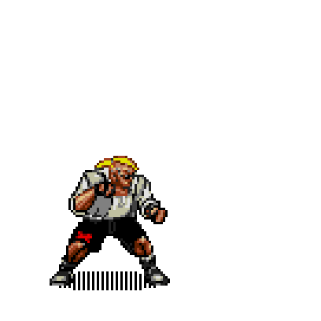

# Comics Zone: Glitch

 

Some description

### Roadmap

- [x] Game engine
- [ ] Game mechanics
- [ ] Playable version
- [ ] Level 1
- [ ] Level 2
- [ ] Level 3
- [ ] Completed

### Plot

...

### Controls

- ↑, ↓, ←, → - Moves
- Space - Pause
- J - Punch/Kick
- K - Jump
- L - Defense
- Esc - Menu

Gamepad is also supported

### Available moves

- **Uppercut** (↑ + J)  
  

### Technical features

- Free to choose 2D Canvas or DOM render
- Load assets only needed for current scene
- Dark and light themes

## License

The code in this repository is under [MIT license](./LICENSE). But sounds and images belong to their authors and copyright holders and cannot be used for commercial purposes without their consent.

## Attributions

The images and sounds are taken from the following games:

- [Comix Zone](https://en.wikipedia.org/wiki/Comix_Zone)
- ...
