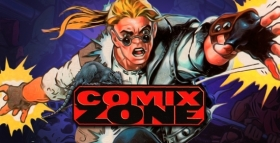

# Comix Zone: Glitch

 

Some description

## Getting started

[Start to play](https://en.wikipedia.org/wiki/Comix_Zone)

### Plot

### Controls

- ↑, ↓, ←, → - moves
- Space - pause
- J - Action
- K - Jump
- L - Special move
- Esc - Menu

Gamepad is also supported

### Available moves

- **Uppercut** (↑ + J)  
  

- **Sit**  
  

## License

The code in this repository is under [MIT license](https://choosealicense.com/licenses/mit/). But sounds and images belong to their copyright holders and cannot be used for commercial purposes without their consent.

The images and sounds are taken from the following games:

- [Comix Zone](https://en.wikipedia.org/wiki/Comix_Zone)
- ...
